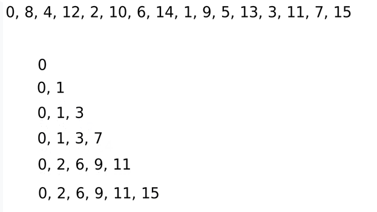

Sequences are ordered lists of numbers that follow a specific pattern or rule. They are fundamental in mathematics and computer science, appearing in topics such as number theory, data analysis, and algorithm design.

---

### What is a Sequence?

A **sequence** is an ordered list of numbers, such as 1, 2, 3, 4, 5 or 2, 4, 8, 16. Sequences can be increasing, decreasing, or follow more complex patterns. Understanding sequences helps us analyze trends, predict future values, and solve a variety of computational problems.

---

### Visualizing Sequences

The image below shows a sequence and how its increasing subsequences can be built step by step. Each line represents the current state of the longest increasing subsequence as new numbers are added. This visualization helps you see how dynamic programming builds up the solution:

 <small>Figure: Building the longest increasing subsequence step by step.</small>

---

In this experiment, you will learn to solve **two core problems** related to sequences:

### 1. Longest Continuous Decreasing Subsequence

**Task:** Given a list of numbers, find the length of the longest contiguous subsequence where each number is smaller than the previous one.

**Key Idea:** Track the length of the current decreasing sequence and update the maximum length found so far as you scan the list.

### 2. Longest Increasing Subsequence (LIS)

**Task:** Given a list of numbers, find the length of the longest subsequence (not necessarily contiguous) where each number is larger than the previous one.

**Key Idea:** Use dynamic programming to efficiently build up the solution, as visualized in the image above. At each step, extend the longest increasing subsequence found so far.

---

By mastering these two problems, you will gain foundational skills for analyzing and solving a wide range of sequence-related challenges in algorithms, data analysis, and mathematical modeling. The experiment is designed to build your problem-solving skills through hands-on coding and algorithmic thinking.
